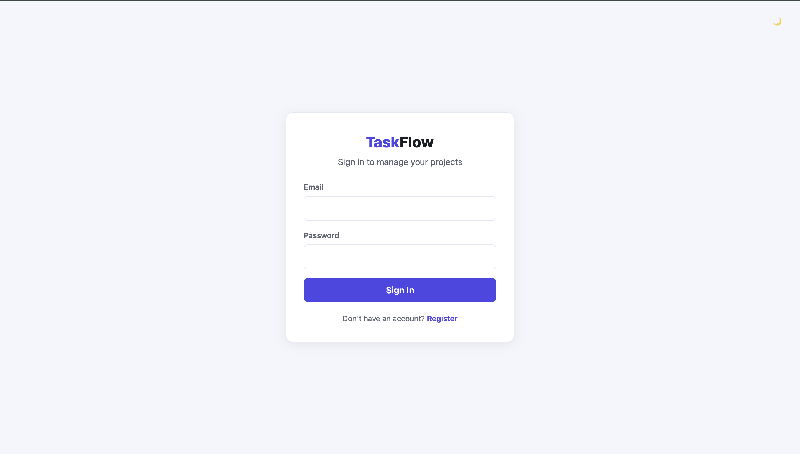
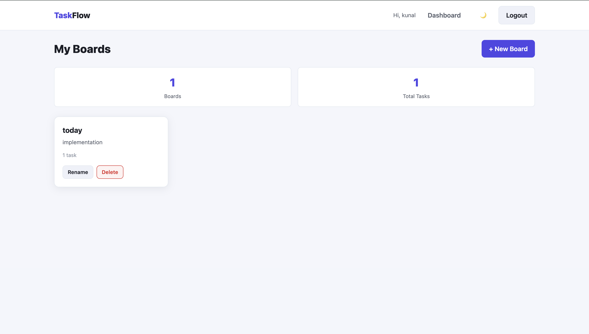
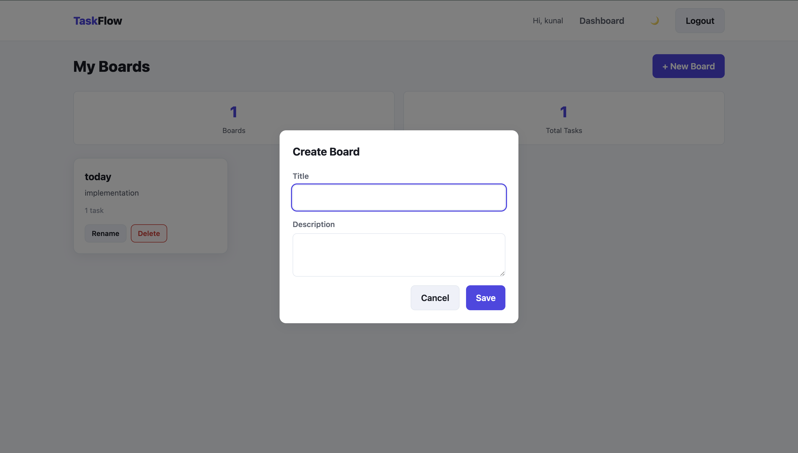
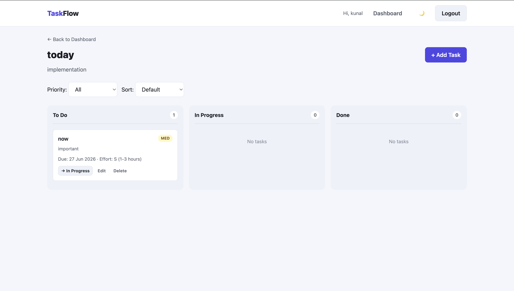
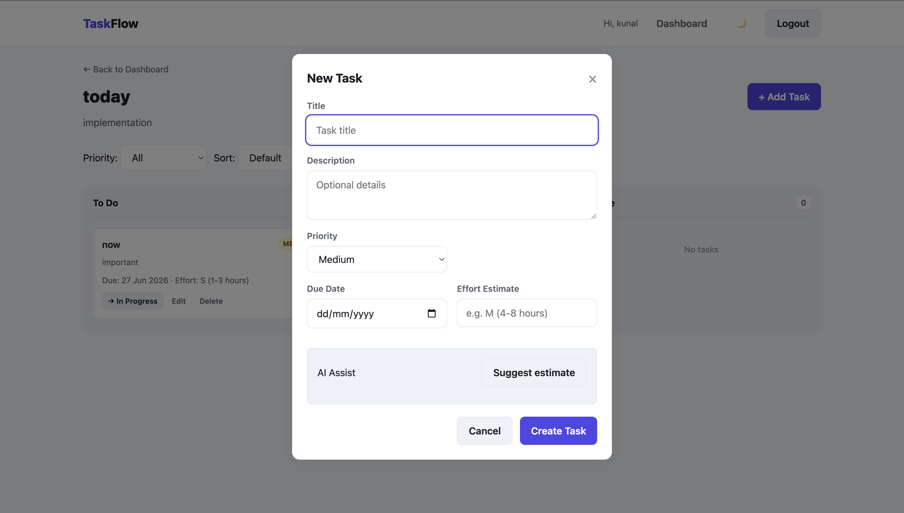

# TaskFlow

A full-stack task and project management application — a lightweight Trello/Asana built with React, Express, PostgreSQL, and a smart AI due-date/effort estimator.


## Features

- **Authentication** — Register, login, JWT sessions, protected routes
- **Boards** — Create, rename, delete project boards (scoped per user)
- **Kanban tasks** — To Do / In Progress / Done columns with priority, due dates, effort estimates
- **AI Assist** — Server-side Gemini API suggests effort + due date (with mock fallback)
- **Filters & sorting** — Filter by priority, sort by due date or priority
- **Dark / Light mode** — Theme toggle persisted in localStorage
- **Responsive UI** — Works on mobile, tablet, and desktop

## Tech Stack

| Layer | Technology |
|-------|------------|
| Frontend | React 18, React Router v6, Axios, CSS Modules, Vite |
| Backend | Node.js, Express.js, express-validator |
| Database | PostgreSQL, Prisma ORM |
| Auth | JWT + bcrypt |
| AI | Google Gemini API (`gemini-2.0-flash`) |

## Project Structure

```
taskflow/
├── client/          # React frontend (Vite)
├── server/          # Express REST API
│   ├── prisma/      # Schema & migrations
│   └── src/         # Routes, controllers, middleware, services
└── README.md
```

## AI Feature

When creating or editing a task, click **Suggest estimate**. The backend sends the task title and description to **Google Gemini** and returns:

- Effort estimate (e.g. `M (4-8 hours)`)
- Suggested due date
- Brief reasoning

**Why Gemini?** Generous free tier, fast responses, easy SDK integration.

**Fallback:** If the API key is missing, times out, or errors, a heuristic mock estimate is returned so the app always works.

## API Documentation

Base URL: `https://taskflow-6w37.onrender.com/`

### Auth

| Method | Path | Auth | Description |
|--------|------|------|-------------|
| POST | `/auth/register` | No | Register `{ name, email, password }` |
| POST | `/auth/login` | No | Login `{ email, password }` → JWT |
| GET | `/auth/me` | Yes | Get current user |

### Boards

| Method | Path | Auth | Description |
|--------|------|------|-------------|
| GET | `/boards` | Yes | List user's boards |
| POST | `/boards` | Yes | Create `{ title, description? }` |
| GET | `/boards/:id` | Yes | Get board with tasks |
| PATCH | `/boards/:id` | Yes | Update board |
| DELETE | `/boards/:id` | Yes | Delete board + tasks |

### Tasks

| Method | Path | Auth | Description |
|--------|------|------|-------------|
| POST | `/boards/:boardId/tasks` | Yes | Create task |
| PATCH | `/tasks/:id` | Yes | Update task (status, priority, etc.) |
| DELETE | `/tasks/:id` | Yes | Delete task |

### AI

| Method | Path | Auth | Description |
|--------|------|------|-------------|
| POST | `/ai/suggest-estimate` | Yes | `{ title, description? }` → estimate |

### Health

| Method | Path | Auth | Description |
|--------|------|------|-------------|
| GET | `/health` | No | API health check |

**Response format:**

```json
{ "success": true, "data": { ... } }
{ "success": false, "message": "Error message", "errors": [] }
```

## Deployment

### Frontend (Vercel)

1. Import the repo, set root directory to `client`
2. Set env: `VITE_API_URL=https://your-api.onrender.com/api`
3. Deploy

### Backend (Render / Railway)

1. Create a web service pointing to `server/`
2. Set environment variables from `server/.env.example`
3. Build command: `npm install && npx prisma generate`
4. Start command: `npx prisma migrate deploy && npm start`
5. Set `CLIENT_URL` to your Vercel frontend URL

### Database

Use a hosted PostgreSQL provider (Neon, Supabase, Railway Postgres) and set `DATABASE_URL`.

## Live Demo

| Service | URL                                      |
|---------|------------------------------------------|
| Frontend | https://task-flow-eight-woad.vercel.app/ |
| Backend | https://taskflow-6w37.onrender.com/      |


## Screenshots

## Login Page



### Dashboard



### Board



### Task



### AI



## Known Limitations & Future Improvements

- Column moves use buttons (drag-and-drop planned as bonus)
- No collaboration / board sharing yet
- No activity log or global search
- AI estimates are suggestions only — user must accept manually
- Would add: TanStack Query, integration tests, charts dashboard, pagination

## License

MIT — built by me as a full-stack developer take-home assignment with ❤️.
